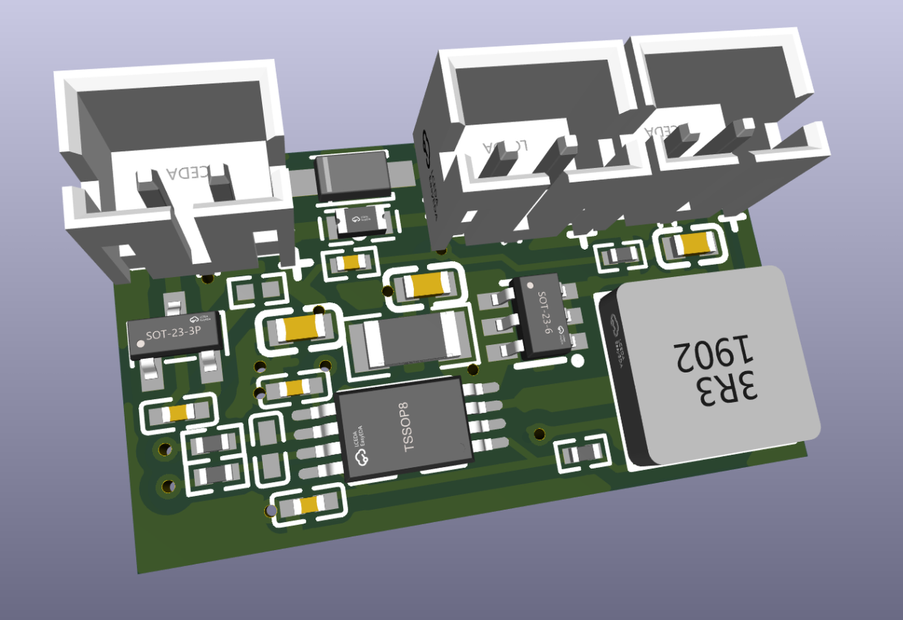

# [micromppt](https://eigenlucy.github.io/projects/micromppt/)

SPV1040 Based 5W MPPT Boost Charger With Autonomous Perturb-and-Observe Set Point Adjustment

Tiny, versatile, high efficiency solar charging, designed with Meshtastic clients in mind

This release has been configured for single cell lipo charging, and includes an [XB3306](https://www.lcsc.com/datasheet/lcsc_datasheet_2106062206_XySemi-XB3306D_C2759992.pdf) lithium battery protection circuit. I have tested this converter with avariety of cell chemistries, as well as supercapacitors, and I will release a more minimal SPV1040 package in the upcoming week with configuration guidelines to for a more general purpose multichemistry solar charging module. [See the project page on my website for more configuration guidelines, panel recommendations, and ordering info (WIP)](https://eigenlucy.github.io/projects/micromppt/).

Built with atopile and KICAD 9. See my [atopile usage guide](/ATO_USAGE.md) for help installing and using atopile
